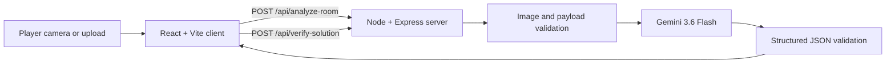

# RoomQuest

### Turn any physical room into an AI-powered escape adventure

RoomQuest is a camera-first web game that transforms a real room into a
three-stage escape quest. A player photographs their space, Gemini identifies
three visible physical objects, and the game turns those objects into rhyming
riddles woven through a generated story. Players solve each riddle by finding
the object and submitting a close-up photo for AI verification.

**[Play the live app](https://pocket-detective.vercel.app/)**

## What RoomQuest does

Traditional escape rooms require a purpose-built location and fixed puzzle
design. RoomQuest builds a new game from the room the player is already in:

1. The host takes or uploads one to three wide photos of a room.
2. Gemini analyzes the room angles together and chooses exactly three distinct
   visible objects.
3. RoomQuest generates an opening narrative and a rhyming riddle for each
   object.
4. The player searches the physical room and submits a close-up solution photo.
5. Gemini verifies the photo against the hidden target object.
6. A correct answer unlocks the next story beat and clue; an incorrect answer
   returns a gentle, non-spoiler hint.
7. Solving all three clues completes the quest and launches the victory
   celebration.

Every generated quest is grounded in the player's surroundings, so the same
application can create different puzzles in a bedroom, office, living room, or
classroom.

## Highlights

- **Room-aware quest generation** — Gemini uses the uploaded room image to
  select real, visible objects instead of inventing generic targets.
- **Multi-angle room setup** — a guided host wizard accepts one required room
  view and up to two optional angles for better object selection.
- **Multimodal answer verification** — every solution is checked from a new
  close-up image against the current clue's target.
- **Structured AI output** — both Gemini calls use strict JSON schemas, followed
  by server-side runtime validation before data reaches the UI.
- **Five-step React state machine** — the interface moves through
  `SCAN_ROOM`, `LOADING_QUEST`, `PLAYING_CLUE`, `VERIFYING_PHOTO`, and
  `GAME_OVER`.
- **Camera and file support** — mobile players can open the rear camera while
  desktop players can upload JPEG, PNG, or WebP images.
- **Vercel-safe image processing** — room and solution photos are resized and
  compressed in the browser before upload to stay below serverless payload
  limits.
- **Spoiler-aware interface** — target object names are kept out of the active
  riddle and verification screens.
- **Progress tracking** — a timer, stage indicator, solved-object inventory, and
  narrative unlocks keep the quest easy to follow.
- **Responsive immersive UI** — glass panels, animated scanning effects,
  generated feedback, sound cues, and reduced-motion-aware confetti create a
  game-like experience on mobile and desktop.
- **Private API boundary** — the Gemini key stays on the Node server and is
  never shipped in the React bundle.
- **Safe failure behavior** — API failures never silently mark a solution as
  correct. The player receives a recoverable error and can retry.
- **Host override** — if vision rejects a valid answer, the host can mark the
  current object correct and keep the game moving.

## Gameplay flow

```text
SCAN_ROOM
    ↓
LOADING_QUEST
    ↓
PLAYING_CLUE ──────── incorrect photo ───────┐
    ↓                                        │
VERIFYING_PHOTO ─────────────────────────────┘
    ↓ correct photo
Next clue, or GAME_OVER after clue three
```

During a quest, React keeps four pieces of core game data:

- the current state-machine step;
- the generated quest data;
- the current clue index;
- the most recent verification feedback.

Additional UI state controls the timer, inventory, camera modal, navigation,
captured image preview, and error banner.

## Architecture



The application deliberately separates browser responsibilities from AI
responsibilities:

### React client

- captures up to three room angles and individual solution photos;
- normalizes uploads to JPEG and limits the longest side to 1,600 pixels;
- keeps each room angle below 900 KB and solution photos below 3 MB so encoded
  requests remain within Vercel's function payload limit;
- renders loading, gameplay, verification, feedback, and completion views;
- manages the quest state machine, timer, inventory, and modal state;
- calls same-origin API endpoints through a typed request helper;
- applies a 70-second browser timeout so stalled requests remain recoverable.

### Node/Express server

- loads `GEMINI_API_KEY` from the server environment;
- validates processed image data URLs, MIME types, payload size, and target
  names;
- accepts one to three room images with a combined decoded size below 3 MB and
  individual solution images below 3 MB, while the browser permits source JPEG,
  PNG, and WebP files under 15 MB each;
- calls Gemini with a 60-second timeout and up to three attempts;
- enforces structured output schemas;
- validates clue count, unique IDs, unique target objects, riddle line count, and
  feedback fields;
- returns safe public errors without leaking credentials or raw provider
  responses;
- serves the Vite application in production.

### Gemini

RoomQuest uses the official `@google/genai` SDK and defaults to
`gemini-3.6-flash`. The model can be overridden with the `GEMINI_MODEL`
environment variable.

Gemini performs two separate multimodal tasks:

1. **Quest generation** analyzes one to three views of the same room and returns
   the opening narrative plus exactly three object-based clues.
2. **Solution verification** compares a close-up submission with the current
   target and returns a verdict, detected item, and player-facing feedback.

## API endpoints

### `GET /api/health`

Returns a lightweight runtime check without calling Gemini:

```json
{
  "ok": true,
  "service": "roomquest-api"
}
```

### `POST /api/analyze-room`

Generates a quest from one to three views of the same room.

Request:

```json
{
  "images": [
    "data:image/jpeg;base64,...",
    "data:image/jpeg;base64,..."
  ]
}
```

The `image` field is still accepted for backward compatibility with older
single-photo clients.

Successful response:

```json
{
  "success": true,
  "data": {
    "opening_narrative": "A mysterious signal wakes inside the room...",
    "clues": [
      {
        "clue_id": 1,
        "target_object_name": "blue ceramic coffee mug",
        "poetic_clue": "I cradle warmth at break of day,\nIn glazed blue robes I wait away.",
        "storyline_continuation": "The first seal flickers to life."
      },
      {
        "clue_id": 2,
        "target_object_name": "silver desk lamp",
        "poetic_clue": "When evening falls I banish night,\nA silver neck that carries light.",
        "storyline_continuation": "A second symbol glows across the wall."
      },
      {
        "clue_id": 3,
        "target_object_name": "red throw pillow",
        "poetic_clue": "I wait where weary heads may rest,\nIn crimson cloth upon my chest.",
        "storyline_continuation": "The final lock opens and the room is yours."
      }
    ]
  }
}
```

Every response must contain exactly three complete, distinct clues.

### `POST /api/verify-solution`

Checks a close-up solution photo against the hidden target object.

Request:

```json
{
  "image": "data:image/jpeg;base64,...",
  "target_object_name": "blue ceramic coffee mug"
}
```

Successful response:

```json
{
  "success": true,
  "data": {
    "is_correct": true,
    "detected_item": "blue mug",
    "feedback_message": "Excellent work—the first lock just clicked open!"
  }
}
```

Errors use an appropriate HTTP status with a safe message:

```json
{
  "error": "Gemini took too long to respond. Please try again."
}
```

## Technology stack

| Layer | Technology | Responsibility |
| --- | --- | --- |
| UI | React 19 | Views, state machine, camera workflow, and inventory |
| Styling | Tailwind CSS 4 | Responsive visual system and animations |
| Frontend tooling | Vite 6 | Development middleware and production client build |
| API server | Node.js + Express 4 | Secure API boundary and production static serving |
| AI SDK | `@google/genai` | Gemini multimodal and structured-output requests |
| AI model | `gemini-3.6-flash` | Room analysis, riddle generation, and photo verification |
| Language | TypeScript 5 | Shared types across browser and server |
| Bundling | esbuild | Production server bundle |

## Project structure

```text
roomquest/
├── server.ts                      # Express API, Gemini calls, and validation
├── api/
│   ├── analyze-room.ts            # Vercel quest-generation function
│   ├── health.ts                  # Vercel runtime health check
│   └── verify-solution.ts         # Vercel verification function
├── src/
│   ├── api/
│   │   └── roomQuest.ts           # Typed browser API client
│   ├── components/
│   │   ├── HostSetupView.tsx      # Room camera/upload step
│   │   ├── LoadingScreenView.tsx  # Quest-generation state
│   │   ├── GameplayView.tsx       # Narrative and current riddle
│   │   ├── CameraCaptureModal.tsx # Solution camera/upload workflow
│   │   ├── VerificationView.tsx   # AI verification state
│   │   ├── FeedbackModal.tsx      # Correct/incorrect result
│   │   └── QuestCompleteView.tsx  # Final results and celebration
│   ├── data/
│   │   └── sampleRooms.ts         # Optional sample room presets
│   ├── utils/
│   │   ├── audio.ts               # Interaction sound effects
│   │   └── image.ts               # Client resize and compression pipeline
│   ├── server/
│   │   └── roomQuest.ts           # Shared Gemini and validation logic
│   ├── App.tsx                    # Game state and event orchestration
│   ├── index.css                  # Global effects and animations
│   ├── main.tsx                   # React entry point
│   └── types.ts                   # Shared quest and verification types
├── .env.example                   # Environment variable template
├── package.json                   # Scripts and dependencies
├── tsconfig.json
├── vercel.json                    # Vercel build and function configuration
└── vite.config.ts
```

## Run locally

### Prerequisites

- Node.js 20 or newer
- npm
- a Gemini API key

### Installation

1. Clone the repository:

   ```bash
   git clone https://github.com/zidanefrost/pocket_detective.git
   cd pocket_detective
   ```

2. Install dependencies:

   ```bash
   npm install
   ```

3. Create the local environment file:

   macOS or Linux:

   ```bash
   cp .env.example .env
   ```

   Windows PowerShell:

   ```powershell
   Copy-Item .env.example .env
   ```

4. Add the Gemini API key to `.env`:

   ```dotenv
   GEMINI_API_KEY="your-api-key"
   GEMINI_MODEL="gemini-3.6-flash"
   PORT="3000"
   ```

5. Start the development server:

   ```bash
   npm run dev
   ```

6. Open <http://localhost:3000>.

The development command starts one Node process. Express handles the API routes,
and Vite runs as middleware for the React client.

## Environment variables

| Variable | Required | Default | Description |
| --- | --- | --- | --- |
| `GEMINI_API_KEY` | Yes | None | Server-only credential used by `@google/genai` |
| `GEMINI_MODEL` | No | `gemini-3.6-flash` | Gemini model used by both AI operations |
| `PORT` | No | `3000` | Port used by the Express server |
| `NODE_ENV` | No | Development | Set to `production` when serving the built app |

Do not prefix the API key with `VITE_`. Vite exposes variables with that prefix
to browser code.

## Available scripts

| Command | Description |
| --- | --- |
| `npm run dev` | Start Express with Vite development middleware |
| `npm run lint` | Run TypeScript checks without emitting files |
| `npm run build:client` | Build only the Vite client for Vercel |
| `npm run build` | Build the React client and bundle the Node server |
| `npm start` | Run the production server from `dist/server.cjs` |
| `npm run clean` | Remove generated build output |

## Production

Build and start the application:

```bash
npm run build
NODE_ENV=production npm start
```

On Windows PowerShell:

```powershell
npm run build
$env:NODE_ENV = "production"
npm start
```

For a hosted environment:

- configure `GEMINI_API_KEY` as a protected server-side environment variable;
- optionally configure `GEMINI_MODEL` and `PORT`;
- run the production build before starting the server;
- use HTTPS so mobile browsers can grant camera access;
- do not place the API key in client-side settings or committed files.

The current public deployment is available at
[pocket-detective.vercel.app](https://pocket-detective.vercel.app/).

## Security and privacy

- `.env` files are excluded from Git; `.env.example` contains placeholders only.
- The Gemini API key is read exclusively by the Node server.
- Images are sent from the browser to the same-origin Express API and then to
  Gemini as inline request data.
- The application does not write uploaded photos to disk or store them in a
  database.
- Server errors expose controlled messages rather than raw Gemini responses.
- Invalid files, unsupported formats, oversized images, malformed JSON, and
  duplicate or incomplete clues are rejected.

RoomQuest currently has no accounts or persistent game storage. Refreshing the
page starts a new browser session.

## Troubleshooting

### “RoomQuest is not configured yet”

Create `.env`, add a real `GEMINI_API_KEY`, and restart `npm run dev`.

### The camera does not open

Allow camera permission in the browser. Camera APIs generally require
`localhost` during development or HTTPS in production. The file picker remains
available if a camera is unavailable.

### A sample room does not load

The remote sample image may be unavailable or blocked by the browser. Upload or
take a local room photo instead.

### Gemini times out or reports that it is busy

Wait briefly and retry. The server retries transient provider failures, and the
UI returns to a usable state instead of accepting the clue automatically.

### The build succeeds but `npm start` cannot find files

Run `npm run build` before `npm start`. Production assets and the bundled server
are generated in `dist/`.

### An image is rejected

Use JPEG, PNG, or WebP files under 15 MB each. One wide, well-lit main room
photo is required; up to two additional angles can improve object selection. A
clear close-up produces more reliable solution verification.
